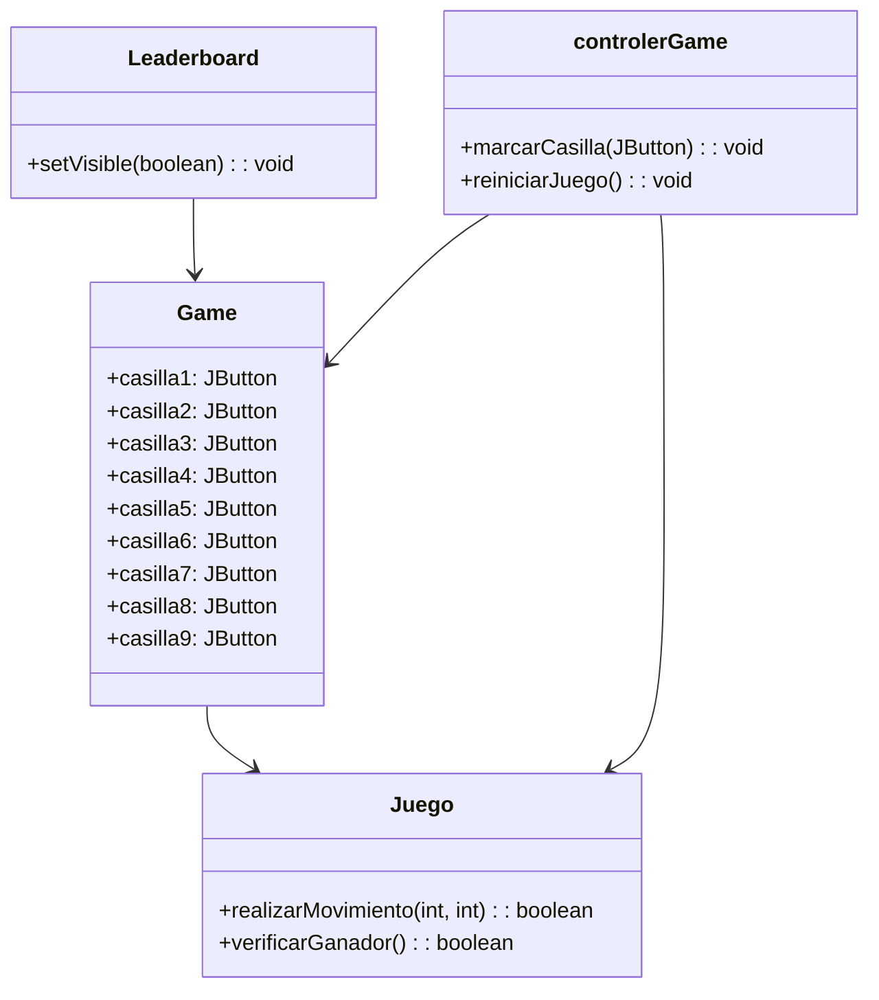

# Proyecto  3 en Raya

---
# Diagrama de Flujo



# Diagrama de Secuencia


```mermaid
sequenceDiagram
    participant Leaderboard
    participant Game
    participant Juego
    participant controlerGame

    Leaderboard->>+Game: setVisible(true)
    Game->>+controlerGame: crearInstanciaJuego()
    controlerGame->>+Juego: crearJuego()
    Juego->>controlerGame: Juego creado
    controlerGame->>-Game: Juego creado
    Game->>-Leaderboard: Game visible
    Leaderboard->>+Game: esperarJugadas()
    Game->>+controlerGame: marcarCasilla()
    controlerGame->>Juego: realizarMovimiento()
    Juego->>Juego: Actualizar estado
    Juego->>controlerGame: Movimiento realizado
    controlerGame->>-Game: Movimiento realizado
    Game->>Leaderboard: Actualizar interfaz
    alt
        Juego-->>Juego: Verificar ganador
        Juego-->>controlerGame: Ganador encontrado
        controlerGame->>-Game: Ganador encontrado
        Game->>-Leaderboard: Ganador encontrado
    else
        Juego-->>Juego: Verificar empate
        Juego-->>controlerGame: Empate encontrado
        controlerGame->>-Game: Empate encontrado
        Game->>-Leaderboard: Empate encontrado
    end
    Game->>+controlerGame: reiniciarJuego()
    controlerGame->>Juego: reiniciarJuego()
    Juego->>Juego: Reiniciar juego
    Juego->>controlerGame: Juego reiniciado
    controlerGame->>-Game: Juego reiniciado
    Game->>-Leaderboard: Juego reiniciado
```