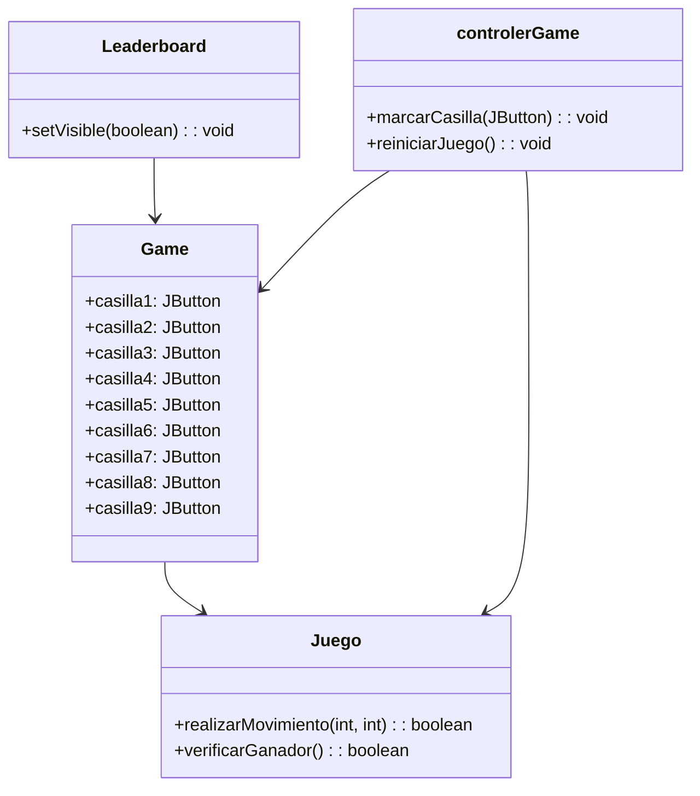
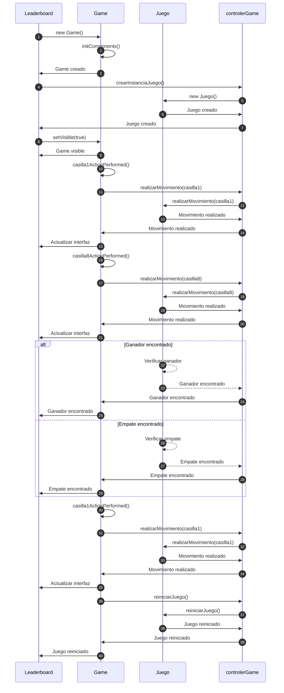

# Proyecto  3 en Raya

¡Hola a todos!

Somos Jorge Usatorre y Cristian Moreira, dos entusiastas estudiantes de DAM1 (Desarrollo de Aplicaciones Multiplataforma). Estamos emocionados de anunciar que nos hemos embarcado en un emocionante proyecto: el desarrollo del juego "3 en Raya" utilizando el lenguaje Java y aplicando el patrón MVC (Modelo-Vista-Controlador).

El juego "3 en Raya" es un clásico que muchos de ustedes pueden recordar de su infancia. Nuestro objetivo es recrear esta experiencia en un entorno digital, aprovechando las capacidades del lenguaje Java y la estructura MVC para crear un juego interactivo y atractivo.

El patrón MVC, que significa Modelo-Vista-Controlador, es una forma de organizar el código de una aplicación para separar las responsabilidades y facilitar su mantenimiento y evolución. En nuestro caso, utilizaremos este patrón para dividir claramente las partes del juego: el modelo se encargará de la lógica y el estado del juego, la vista mostrará la interfaz gráfica al jugador y el controlador manejará las interacciones del usuario.

Estamos emocionados de poner en práctica nuestros conocimientos adquiridos en el curso y aplicarlos a un proyecto real. Además, esta será una excelente oportunidad para mejorar nuestras habilidades de programación y trabajar en equipo.

Esperamos crear un juego "3 en Raya" atractivo y divertido que pueda ser disfrutado por todos. Estamos comprometidos a trabajar arduamente y asegurarnos de que el juego sea de alta calidad y brinde una experiencia gratificante.

¡Estén atentos a futuras actualizaciones! Estamos seguros de que tendremos mucho progreso que compartir y esperamos que se unan a nosotros en esta emocionante aventura de desarrollo de juegos.

¡Gracias por su apoyo y nos vemos pronto!

Jorge Usatorre y Cristian Moreira

## Diagrama de Flujo

# Diagrama de Secuencia

