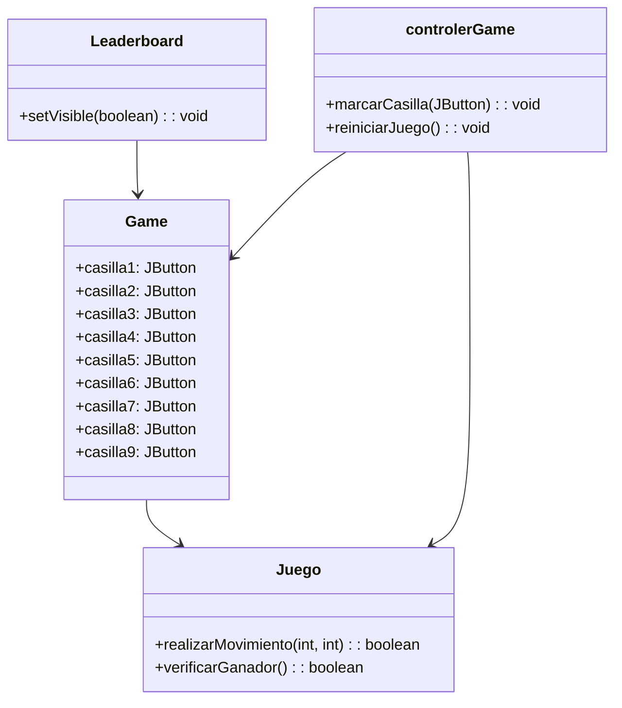

# Proyecto  3 en Raya

---
# Diagrama de Flujo



# Diagrama de Secuencia


```mermaid
sequenceDiagram
    participant Leaderboard
    participant Game
    participant Juego
    participant controlerGame

    Leaderboard->>+Game: new Game()
    Game->>+Game: initComponents()
    Game->>-Leaderboard: Game creado

    Leaderboard->>+controlerGame: crearInstanciaJuego()
    controlerGame->>+Juego: new Juego()
    Juego->>-controlerGame: Juego creado
    controlerGame->>-Leaderboard: Juego creado

    Leaderboard->>+Game: setVisible(true)
    Game->>-Leaderboard: Game visible

    Game->>+Game: casilla1ActionPerformed()
    Game->>+controlerGame: realizarMovimiento(casilla1)
    controlerGame->>+Juego: realizarMovimiento(casilla1)
    Juego->>-controlerGame: Movimiento realizado
    controlerGame->>-Game: Movimiento realizado
    Game->>-Leaderboard: Actualizar interfaz

    Game->>+Game: casilla8ActionPerformed()
    Game->>+controlerGame: realizarMovimiento(casilla8)
    controlerGame->>+Juego: realizarMovimiento(casilla8)
    Juego->>-controlerGame: Movimiento realizado
    controlerGame->>-Game: Movimiento realizado
    Game->>-Leaderboard: Actualizar interfaz

    alt Ganador encontrado
        Juego-->>Juego: Verificar ganador
        Juego-->>controlerGame: Ganador encontrado
        controlerGame->>-Game: Ganador encontrado
        Game->>-Leaderboard: Ganador encontrado
    else Empate encontrado
        Juego-->>Juego: Verificar empate
        Juego-->>controlerGame: Empate encontrado
        controlerGame->>-Game: Empate encontrado
        Game->>-Leaderboard: Empate encontrado
    end
Game->>+Game: casilla1ActionPerformed()
    Game->>+controlerGame: realizarMovimiento(casilla1)
    controlerGame->>+Juego: realizarMovimiento(casilla1)
    Juego->>-controlerGame: Movimiento realizado
    controlerGame->>-Game: Movimiento realizado
    Game->>-Leaderboard: Actualizar interfaz

    Game->>+controlerGame: reiniciarJuego()
    controlerGame->>+Juego: reiniciarJuego()
    Juego->>-controlerGame: Juego reiniciado
    controlerGame->>-Game: Juego reiniciado
    Game->>-Leaderboard: Juego reiniciado

```
